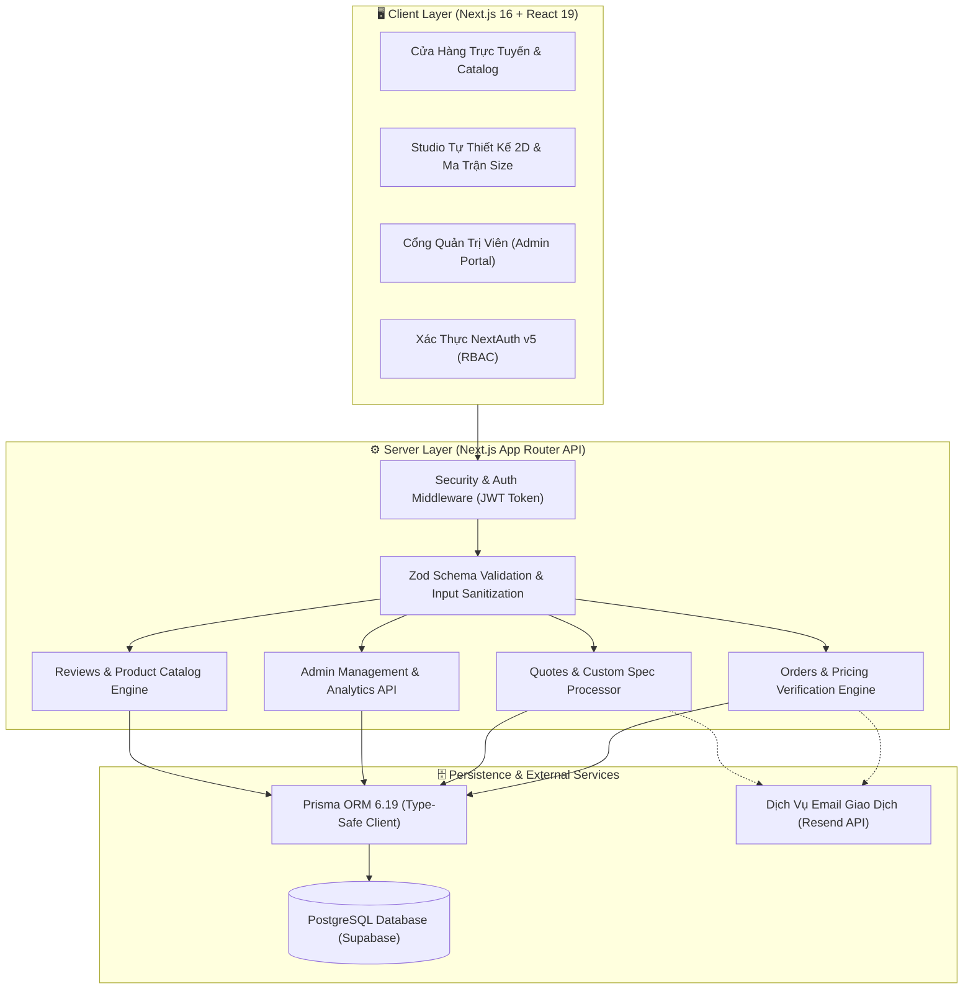
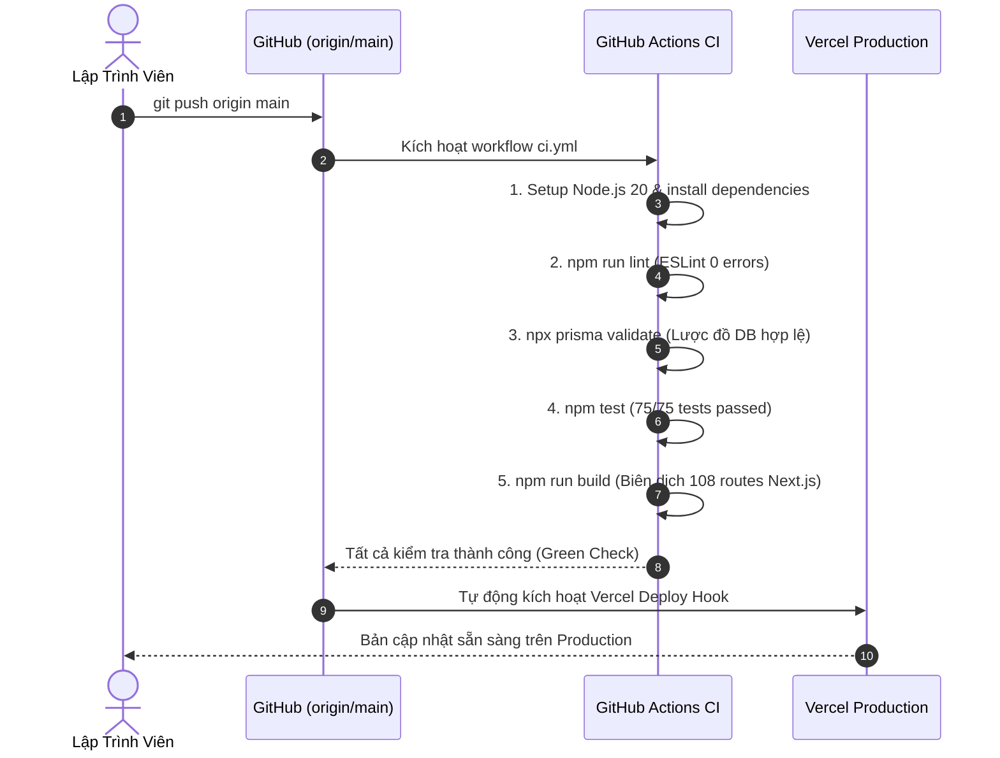

# 👔 HUNI UNIFORM — HDC FASHION

> **Nền tảng thương mại điện tử & hệ thống may đo đồng phục doanh nghiệp cao cấp tiêu chuẩn B2B/B2C**  
> Phát triển bởi **HDC GROUP VN** trên nền tảng **Next.js 16 (App Router)**, **React 19**, **Tailwind CSS v4**, **Prisma ORM** và **PostgreSQL (Supabase)**.

---

[](https://nextjs.org)
[](https://react.dev)
[](https://tailwindcss.com)
[](https://prisma.io)
[](https://supabase.com)
[](https://authjs.dev)
[](https://vitest.dev)
[](https://github.com/BDuc1906/HUNI/actions)
[](./LICENSE)

---

## 📑 Mục Lục

1. [Tổng Quan Dự Án](#-tổng-quan-dự-án)
2. [Kiến Trúc Hệ Thống](#-kiến-trúc-hệ-thống)
3. [Tính Năng Trọng Tâm](#-tính-năng-trọng-tâm)
4. [Ngăn Xếp Công Nghệ (Tech Stack)](#-ngăn-xếp-công-nghệ-tech-stack)
5. [Cấu Trúc Thư Mục](#-cấu-trúc-thư-mục)
6. [Thiết Lập Môi Trường & Cài Đặt](#-thiết-lập-môi-trường--cài-đặt)
7. [Chạy Kiểm Thử (Testing & QA)](#-chạy-kiểm-thử-testing--qa)
8. [Hệ Thống REST API & Phân Quyền RBAC](#-hệ-thống-rest-api--phân-quyền-rbac)
9. [Quy Trình CI/CD & Triển Khai (Deployment)](#-quy-trình-cicd--triển-khai-deployment)
10. [Bảo Mật & Tiêu Chuẩn Vận Hành](#-bảo-mật--tiêu-chuẩn-vận-hành)
11. [Liên Hệ & Bản Quyền](#-liên-hệ--bản-quyền)

---

## 🏢 Tổng Quan Dự Án

**HUNI UNIFORM** là hệ thống giải pháp may mặc và đồng phục doanh nghiệp toàn diện, tích hợp trực tiếp quy trình khép kín:
* **Khách hàng doanh nghiệp (B2B):** Tự thiết kế mẫu 2D trực quan, tự phân bổ ma trận kích cỡ (Nam, Nữ, Unisex), dự toán giá sỉ theo số lượng và gửi yêu cầu may mẫu thử 0đ.
* **Khách hàng cá nhân (B2C):** Mua sắm sản phẩm may sẵn cao cấp, áp dụng mã voucher, thanh toán trực tuyến qua VietQR và theo dõi tiến độ đơn hàng theo thời gian thực.
* **Ban quản trị & Xưởng may (Admin):** Quản lý trạng thái đơn hàng, phê duyệt báo giá doanh nghiệp, kiểm soát kho sản phẩm, theo dõi khách hàng và cấu hình mã giảm giá.

### Các Năng Lực Cốt Lõi
* **Năng lực xưởng:** Quy mô 2.500m², sản lượng 50.000 sản phẩm/tháng.
* **Công nghệ may:** Áo sơ mi không đường may (Seamless), thêu vi tính Tajima 3D Nhật Bản, in chuyển nhiệt PET 4K sắc nét.
* **Chất liệu vải sinh thái:** Vải sợi tre kháng khuẩn (Bamboo Silk), Cotton Compact 100% 250gsm, Pique Cá Sấu CVC 65/35, Nano chống nhăn nhập khẩu Ý.

---

## 🏛️ Kiến Trúc Hệ Thống

Dự án áp dụng mô hình phân lớp rõ ràng (Layered Architecture) chuẩn Next.js App Router, tách biệt giữa giao diện khách hàng, tầng nghiệp vụ (Domain Services), tầng truy cập dữ liệu (Prisma ORM) và lớp bảo mật:



---

## ✨ Tính Năng Trọng Tâm

### 1. 🎨 Studio Thiết Kế Đồng Phục 2D & Phân Bổ Kích Cỡ (`/thiet-ke-dong-phuc`)
* **Mô phỏng Vector trực quan (Garment Mockup):** Hỗ trợ Áo Polo, Áo Sơ Mi, Áo Thun cổ tròn, Đồng phục Golf & Thể thao, Áo Khoác Gió.
* **Tùy biến góc nhìn & chi tiết:** Chuyển đổi linh hoạt giữa mặt trước và mặt sau; phối màu thân áo từ bảng màu chuẩn doanh nghiệp; cấu hình cổ áo (trơn, vi tính 2 sọc, phối màu tương phản).
* **Định vị logo & kỹ thuật thêu:** Tải logo thương hiệu hoặc gõ slogan dạng text; điều chỉnh kích thước; gắn chính xác vào 6 vị trí chuẩn (ngực trái/phải, giữa ngực, tay áo, sau lưng, sau gáy).
* **Hệ thống ma trận phân bổ kích cỡ (Multi-Size Matrix):**
  * **Chế độ Nam & Nữ:** Bảng size Nam (S - 3XL) form suông công sở; Bảng size Nữ (S - 2XL) form chiết eo tôn dáng; tích hợp nút tăng giảm số lượng tức thì.
  * **Chế độ Unisex:** Phù hợp cho sự kiện teambuilding, thể thao và chạy bộ.
  * **Chế độ Nhập Nhanh:** Cho phép nhập tổng số lượng và gửi danh sách chi tiết sau qua Zalo/Excel.
  * **Phím tắt chia nhanh:** Tự động phân bổ theo tỉ lệ nhân khẩu học chuẩn doanh nghiệp (`30`, `50`, `100`, `200` áo).
* **Bảng tra cứu thông số size (Size Guide Modal):** Bảng so sánh chi tiết số đo chiều cao, cân nặng, vòng ngực, rộng vai, dài áo cùng tư vấn từ chuyên gia kỹ thuật HDC.
* **Dịch vụ mượn áo mẫu thử (Fitting Kit):** Tùy chọn cử chuyên viên mang bộ áo mẫu đủ size đến đo đạc và mặc thử miễn phí tại văn phòng doanh nghiệp.

### 2. 🛍️ Trải Nghiệm Mua Sắm & Đặt Hàng B2B / B2C
* **Báo giá sỉ tự động theo số lượng:** Bậc chiết khấu thông minh (`10 - 29`, `30 - 49`, `50 - 99`, `100 - 199`, `200 - 499`, `500+` áo) tính toán chính xác đơn giá xuất xưởng.
* **Cơ chế chống gian lận giá (Server-side Price Verification):** Server tự động truy vấn giá gốc từ Database và tính toán độc lập; từ chối đơn hàng (HTTP 400) nếu phát hiện sai lệch giá > 1%.
* **Thanh toán VietQR & Đặt cọc 30%:** Tạo mã QR ngân hàng tự động kèm nội dung chuyển khoản mã đơn; hỗ trợ tùy chọn xuất hóa đơn VAT điện tử.
* **Tra cứu tiến độ sản xuất (`/tai-khoan` & `/api/tracking`):** Theo dõi 5 giai đoạn: *Chờ duyệt maket 3D → Đang dệt nhuộm → Đang in/thêu vi tính → KCS kiểm định → Đang giao hàng*.

### 3. 🛡️ Cổng Quản Trị Viên (Admin Portal & RBAC)
* **Kiểm soát truy cập theo vai trò (Role-Based Access Control):** Chỉ người dùng có vai trò `ADMIN` mới được phép truy cập danh sách đơn hàng toàn hệ thống và các tài nguyên quản trị.
* **Quản trị đơn hàng (`/api/admin/orders`):** Cập nhật trạng thái sản xuất, trạng thái thanh toán, lọc theo ngày tạo và giá trị đơn hàng.
* **Quản trị yêu cầu báo giá (`/api/admin/quotes`):** Tiếp nhận thông số kỹ thuật thiết kế, ma trận size, phân công chuyên viên tư vấn trong 15 phút.
* **Quản trị kho hàng & mã ưu đãi (`/api/admin/vouchers`):** Quản lý mã khuyến mãi, giới hạn lượt dùng, số tiền giảm tối đa và ngày hết hạn.

---

## 🛠️ Ngăn Xếp Công Nghệ (Tech Stack)

| Hạng Mục | Công Nghệ / Thư Viện | Phiên Bản | Vai Trò Trong Dự Án |
|---|---|---|---|
| **Core Framework** | [Next.js](https://nextjs.org) | `16.3.6` | App Router, Turbopack, React Server Components, Server Actions |
| **Giao Diện** | [React](https://react.dev) | `19.2.8` | Component architecture, Hooks (`useMemo`, `useState`, `useId`) |
| **Định Kiểu & CSS** | [Tailwind CSS](https://tailwindcss.com) | `v4.0` | Utility-first CSS, CSS nesting, modern color variables |
| **Cơ Sở Dữ Liệu** | [PostgreSQL (Supabase)](https://supabase.com) | `15+` | Lưu trữ dữ liệu quan hệ với ACID transaction toàn diện |
| **ORM & Schema** | [Prisma](https://prisma.io) | `6.19.3` | Quản lý schema, migrations, type-safe database queries |
| **Xác Thực** | [NextAuth.js](https://authjs.dev) | `5.0.0-beta.32` | JWT session management, RBAC (`ADMIN`, `CUSTOMER`) |
| **Validation** | [Zod](https://zod.dev) | `4.6.5` | Xác thực dữ liệu đầu vào tại API routes và form client |
| **Biểu Tượng** | [Lucide React](https://lucide.dev) | `1.48.0` | Bộ icon SVG tối ưu hiệu năng và khả năng truy cập (a11y) |
| **Email Giao Dịch** | [Resend](https://resend.com) | `6.29.0` | Gửi email thông báo đơn hàng và báo giá tức thì |
| **Kiểm Thử (Testing)** | [Vitest](https://vitest.dev) | `5.0.2` | Runner kiểm thử Unit & Integration siêu nhanh |
| **CI/CD** | [GitHub Actions](https://github.com/features/actions) | `v4` | Tự động hóa linting, test coverage, Prisma check và build verification |

---

## 📂 Cấu Trúc Thư Mục

```text
HUNI/
├── .github/
│   └── workflows/
│       ├── ci.yml                 # Pipeline CI tự động: Lint, Test, Prisma check, Build
│       └── deploy.yml             # Pipeline Deploy lên môi trường Staging/Production
├── prisma/
│   ├── schema.prisma              # Định nghĩa mô hình dữ liệu (Database Schema)
│   └── seed.js                    # Dữ liệu khởi tạo chuẩn cho sản phẩm và voucher
├── public/
│   └── images/                    # Tài nguyên tĩnh: Logo, bảng vải, catalogue
├── src/
│   ├── app/                       # Next.js 16 App Router Pages & API Endpoints
│   │   ├── api/                   # Hệ thống REST API (Admin, Orders, Quotes, Products...)
│   │   ├── account/               # Quản lý tài khoản cá nhân & lịch sử đơn
│   │   ├── bang-vai/              # Bảng đặc tính & thành phần 9 chất liệu vải
│   │   ├── dong-phuc-*/           # Danh mục sản phẩm theo ngành nghề (B2B/B2C)
│   │   ├── thiet-ke-dong-phuc/    # Trang Studio Tự Thiết Kế 2D & Ma Trận Kích Cỡ
│   │   ├── tu-thiet-ke/           # Alias định tuyến tối ưu SEO cho studio
│   │   ├── layout.js              # Root Layout, font, analytics & drawer providers
│   │   └── page.jsx               # Trang chủ giới thiệu thương hiệu và năng lực xưởng
│   ├── features/                  # Các module tính năng chuyên biệt
│   │   ├── auth/                  # Components đăng nhập, đăng ký, modal auth
│   │   ├── catalog/               # Bộ lọc, thẻ sản phẩm, quickview modal, reviews
│   │   ├── checkout/              # Quy trình thanh toán, VAT, VietQR drawer
│   │   └── customize/             # Studio 2D, Canvas vector mockup, ma trận size
│   ├── server/                    # Logic phía máy chủ
│   │   ├── auth.js                # Cấu hình NextAuth v5 & JWT session callback
│   │   ├── prisma.js              # Prisma Client singleton
│   │   └── validators.js          # Zod validation schemas tuân thủ API_CONTRACT.md
│   └── shared/                    # Thành phần chia sẻ toàn dự án
│       ├── components/            # Header, Footer, Hero, Modals, Breadcrumbs
│       ├── data/                  # Mock data, hằng số phân cấp siteHierarchy
│       ├── services/              # API Client SDK kết nối đồng bộ Frontend - Backend
│       └── utils/                 # Hàm tiện ích tính giá, sinh mã đơn, định dạng tiền
├── tests/
│   ├── integration/               # Kiểm thử tích hợp các Endpoint API
│   │   ├── api-admin.test.js      # Kiểm thử RBAC và quyền quản trị
│   │   ├── api-orders.test.js     # Kiểm thử đặt hàng và xác thực giá
│   │   ├── api-products.test.js   # Kiểm thử CRUD sản phẩm
│   │   ├── api-quotes.test.js     # Kiểm thử xử lý báo giá
│   │   ├── api-reviews.test.js    # Kiểm thử hệ thống đánh giá
│   │   └── api-tracking.test.js   # Kiểm thử tra cứu tiến độ
│   └── unit/                      # Kiểm thử đơn vị
│       ├── custom-design.test.js  # Kiểm thử ma trận size & tính toán số lượng
│       ├── order-number.test.js   # Kiểm thử sinh mã đơn hàng chuẩn
│       ├── pricing.test.js        # Kiểm thử thuật toán chiết khấu sỉ
│       ├── validators.test.js     # Kiểm thử xác thực Zod schemas
│       └── vouchers.test.js       # Kiểm thử logic áp dụng mã giảm giá
├── .env.example                   # Bản mẫu biến môi trường chuẩn
├── API_CONTRACT.md                # Đặc tả toàn diện quy ước API & phản hồi
├── eslint.config.mjs              # Cấu hình ESLint 9 Flat Config
├── next.config.mjs                # Cấu hình Next.js với Turbopack & tối ưu ảnh
├── package.json                   # Khai báo dependencies và scripts thực thi
└── vitest.config.mjs              # Cấu hình runner Vitest
```

---

## 🚀 Thiết Lập Môi Trường & Cài Đặt

### 1. Yêu Cầu Cấu Hình
* **Node.js:** Phiên bản `≥ 20.10.0` (LTS được khuyến nghị)
* **Package Manager:** `npm ≥ 10.x` hoặc `pnpm ≥ 9.x`
* **Cơ sở dữ liệu:** PostgreSQL 15+ (local instance hoặc tài khoản Supabase Cloud)

### 2. Các Bước Cài Đặt Chi Tiết

#### Bước 1: Sao chép mã nguồn về máy
```bash
git clone https://github.com/BDuc1906/HUNI.git
cd HUNI
```

#### Bước 2: Cài đặt các gói phụ thuộc
```bash
npm install
```

#### Bước 3: Cấu hình biến môi trường
Tạo tệp `.env.local` từ mẫu `.env.example`:
```bash
cp .env.example .env.local
```

Cập nhật các giá trị cấu hình tương ứng trong `.env.local`:
```env
# Database kết nối trực tiếp đến PostgreSQL (Supabase)
DATABASE_URL="postgresql://postgres:[PASSWORD]@[HOST]:5432/postgres?sslmode=require"
DIRECT_URL="postgresql://postgres:[PASSWORD]@[HOST]:5432/postgres?sslmode=require"

# NextAuth v5 Cấu hình bí mật
AUTH_SECRET="your-secure-random-32-characters-secret"
NEXTAUTH_URL="http://localhost:3000"

# Gửi email qua Resend (Tùy chọn)
RESEND_API_KEY="re_xxxxxxxxxxxxxxxxxxxxxxxxx"
ADMIN_EMAIL="support@huniuniform.vn"

# Trợ lý AI Gemini (Tùy chọn)
GEMINI_API_KEY="AIzaxxxxxxxxxxxxxxxxxxxxxxxxx"
```

#### Bước 4: Đồng bộ lược đồ Cơ sở dữ liệu qua Prisma
```bash
# Kiểm tra tính hợp lệ của schema.prisma
npm run db:validate

# Đồng bộ mô hình dữ liệu vào database PostgreSQL
npm run db:push
```

#### Bước 5: Khởi chạy máy chủ phát triển
```bash
npm run dev
```
Mở trình duyệt và truy cập: **`http://localhost:3000`**

---

## 🧪 Chạy Kiểm Thử (Testing & QA)

Dự án duy trì kỷ luật chất lượng code nghiêm ngặt với 75 bài kiểm thử tự động bao phủ cả logic nghiệp vụ (Unit) và giao tiếp mạng/API (Integration):

```bash
# Chạy toàn bộ test suite một lần
npm test

# Chạy trực tiếp qua Vitest runner
npm run test:vitest

# Chạy kiểm thử ở chế độ theo dõi thay đổi (Watch mode)
npm run test:watch

# Thu thập báo cáo độ phủ mã nguồn (Coverage report)
npm run test:coverage

# Kiểm tra chất lượng mã nguồn qua linter (ESLint)
npm run lint

# Kiểm tra quy trình build thành phẩm Next.js
npm run build
```

---

## 🔌 Hệ Thống REST API & Phân Quyền RBAC

Tất cả các API Endpoints đều tuân thủ chuẩn **Response Envelope** được quy định chi tiết tại [`API_CONTRACT.md`](./API_CONTRACT.md):

```json
{
  "success": true,
  "data": { ... },
  "message": "Thông báo xử lý thành công (nếu có)"
}
```

Trường hợp xảy ra lỗi:
```json
{
  "success": false,
  "error": "Mô tả nguyên nhân lỗi bằng tiếng Việt",
  "details": [ ... ]
}
```

### Bảng Tổng Hợp Endpoint API

| Phương Thức | Đường Dẫn API | Quyền Hạn | Mục Đích Sử Dụng |
|:---:|---|:---:|---|
| `POST` | `/api/orders` | 🌐 Public | Tạo đơn hàng mới; server tự xác thực lại giá niêm yết |
| `GET` | `/api/orders` | 🔒 Authenticated | Xem đơn hàng (`ADMIN` xem tất cả, `CUSTOMER` chỉ xem đơn qua `?mine=true`) |
| `POST` | `/api/quotes` | 🌐 Public | Tiếp nhận yêu cầu báo giá doanh nghiệp & phân bổ size |
| `GET` | `/api/quotes` | 🔒 ADMIN | Tra cứu và lọc các phiếu yêu cầu báo giá |
| `GET` | `/api/products` | 🌐 Public | Lấy danh mục sản phẩm (hỗ trợ phân trang, lọc, tìm kiếm) |
| `POST` | `/api/products` | 🔒 ADMIN | Thêm sản phẩm mới vào danh mục hệ thống |
| `GET` | `/api/products/[id]`| 🌐 Public | Chi tiết sản phẩm, biến thể màu sắc và giá sỉ |
| `PUT` | `/api/products/[id]`| 🔒 ADMIN | Cập nhật thông số, hình ảnh, bảng giá sản phẩm |
| `DELETE`| `/api/products/[id]`| 🔒 ADMIN | Ẩn hoặc xóa sản phẩm khỏi hệ thống |
| `GET` | `/api/reviews` | 🌐 Public | Lấy danh sách đánh giá đã được phê duyệt |
| `POST` | `/api/reviews` | 🔒 CUSTOMER | Gửi đánh giá cho sản phẩm đã mua |
| `GET` | `/api/tracking` | 🌐 Public | Tra cứu lộ trình đơn hàng theo mã đơn hoặc SĐT |
| `POST` | `/api/chat` | 🌐 Public | AI tư vấn trang phục 24/7 (luôn trả về HTTP 200 an toàn) |
| `POST` | `/api/register` | 🌐 Public | Đăng ký tài khoản người dùng mới |
| `GET` | `/api/admin/dashboard`| 🔒 ADMIN | Thống kê doanh thu, số đơn, tỉ lệ chốt báo giá |
| `GET` | `/api/admin/customers`| 🔒 ADMIN | Quản lý danh bạ khách hàng doanh nghiệp |
| `GET/POST`| `/api/admin/vouchers` | 🔒 ADMIN | Quản lý danh sách và tạo mã giảm giá mới |

---

## 🔄 Quy Trình CI/CD & Triển Khai (Deployment)

Dự án áp dụng quy trình kiểm soát chất lượng tự động hóa 100% thông qua **GitHub Actions** đặt tại `.github/workflows/`:



### Triển Khai Lên Vercel
1. Kết nối repository GitHub với tài khoản Vercel của tổ chức.
2. Thiết lập cấu hình **Build Command:** `next build` và **Install Command:** `npm install`.
3. Điền đầy đủ các biến môi trường từ `.env.example` vào mục **Settings → Environment Variables** trên Vercel.
4. Mỗi khi pull request được merge vào nhánh `main`, hệ thống sẽ tự động triển khai phiên bản mới nhất.

---

## 🔒 Bảo Mật & Tiêu Chuẩn Vận Hành

1. **Kiểm tra tính toàn vẹn giá (Pricing Invariant):** Không bao giờ tin tưởng giá client gửi lên. Máy chủ tự động tra cứu đơn giá niêm yết trong cơ sở dữ liệu dựa trên số lượng đặt hàng thực tế.
2. **Bảo vệ chống lộ lọt đơn hàng:** Bổ sung lớp bảo vệ RBAC nghiêm ngặt tại `GET /api/orders` — chặn hoàn toàn hành vi quét đơn của người dùng trái phép (trả về HTTP 401/403).
3. **Chuẩn hóa dữ liệu đầu vào (Data Normalization):**
   * Số điện thoại khách hàng tự động loại bỏ ký tự rác và đưa về chuỗi chuẩn 10-11 số (VD: `0984959586`).
   * Ghi chú đơn hàng và thiết kế được giới hạn chặt chẽ $\le 500$ ký tự để chống tràn bộ nhớ hoặc lạm dụng cơ sở dữ liệu.
4. **Mã hóa mật khẩu:** Sử dụng thuật toán `bcryptjs` với salt rounds $\ge 10$ để băm mật khẩu người dùng trước khi lưu trữ.
5. **Khả năng tự phục hồi (Fault Tolerance):** Endpoint trợ lý tư vấn (`/api/chat`) luôn trả về mã HTTP 200 kèm số hotline ngay cả khi dịch vụ bên thứ ba bị quá tải, ngăn chặn tối đa việc vỡ giao diện client.


---

<div align="center">
  <small>© 2026 HUNI UNIFORM — Bản quyền thuộc về HDC GROUP VN. Mọi hành vi sao chép không xin phép đều bị nghiêm cấm.</small>
</div>
